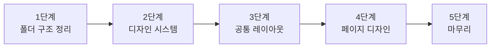

# 블로그 네비게이션 & 디자인 구현 계획

## 현재 프로젝트 상태

```
blog/
├── src/
│   ├── app/
│   │   ├── layout.js          ← 루트 레이아웃 (기본 상태)
│   │   ├── globals.css        ← 전역 스타일 (최소)
│   │   ├── page.js            ← 홈(글 목록) - 인라인 스타일
│   │   ├── page.module.css    ← 미사용 (기본 생성 파일)
│   │   └── posts/[id]/page.js ← 글 상세 - 인라인 스타일
│   └── lib/
│       └── posts.js           ← 마크다운 파서
├── posts/
│   └── hello-world.md
└── public/
```

> [!NOTE]
> 현재 모든 스타일이 인라인으로 작성되어 있고, 공통 네비게이션이 없는 상태입니다.

---

## 구현 계획

### 1단계: 폴더 구조 정리 & 컴포넌트 폴더 생성

```
blog/src/
├── app/
│   ├── layout.js              ← 루트 레이아웃 (네비게이션 + 푸터 포함)
│   ├── globals.css            ← 디자인 시스템 (색상, 글꼴, 간격 등)
│   ├── layout.module.css      ← 루트 레이아웃 전용 스타일
│   ├── page.js                ← 홈 페이지
│   ├── page.module.css        ← 홈 페이지 스타일
│   ├── posts/
│   │   └── [id]/
│   │       ├── page.js        ← 글 상세 페이지
│   │       └── page.module.css
│   └── about/                 ← (예시) 소개 페이지
│       ├── page.js
│       └── page.module.css
├── components/                ← 공통 UI 컴포넌트
│   ├── Header/
│   │   ├── Header.js
│   │   └── Header.module.css
│   ├── Footer/
│   │   ├── Footer.js
│   │   └── Footer.module.css
│   └── PostCard/
│       ├── PostCard.js
│       └── PostCard.module.css
└── lib/
    └── posts.js
```

**핵심 포인트:**
- `components/` 폴더를 만들어 재사용 가능한 UI 조각을 관리
- 각 컴포넌트는 `*.js` + `*.module.css` 한 쌍으로 구성
- 페이지별 스타일도 `page.module.css`로 분리

---

### 2단계: 디자인 시스템 구축 (`globals.css`)

다크모드 대응 색상 체계와 공통 디자인 토큰을 정의합니다.

**포함 내용:**
- 색상 팔레트 (밝은 모드 / 어두운 모드)
- 글꼴 설정 (Google Fonts - Inter 또는 Pretendard 등)
- 간격(spacing) 변수
- 둥근 모서리, 그림자 등 공통 값
- 전환(transition) 기본값

---

### 3단계: 공통 레이아웃 (`layout.js`)

```
┌────────────────────────────────────────────┐
│  Header (네비게이션)                         │
│  ┌──────────────────────────────────────┐   │
│  │  로고   |  홈  |  블로그  |  소개     │   │
│  └──────────────────────────────────────┘   │
├────────────────────────────────────────────┤
│                                            │
│  {children} ← 페이지마다 바뀌는 영역        │
│                                            │
├────────────────────────────────────────────┤
│  Footer (저작권 등)                         │
└────────────────────────────────────────────┘
```

**네비게이션 기능:**
- 현재 활성 메뉴 강조 표시
- 모바일 반응형 (햄버거 메뉴)
- 스크롤 시 고정(sticky) 헤더
- 부드러운 전환 효과

---

### 4단계: 페이지별 디자인 적용

| 페이지 | 주요 UI |
|--------|---------|
| **홈 (`/`)** | 히어로 영역 + 최근 글 카드 목록 |
| **글 상세 (`/posts/[id]`)** | 글 제목/날짜 헤더 + 마크다운 본문 스타일링 |
| **소개 (`/about`)** | 프로필 카드 + 간단한 자기소개 |

---

### 5단계: 마무리 & 다듬기

- 마크다운 본문 스타일링 (코드 블록, 인용, 목록 등)
- 페이지 전환 시 부드러운 효과
- SEO 메타데이터 (제목, 설명)
- 반응형 확인 (모바일, 태블릿, 데스크톱)

---

## 작업 순서 요약



---

## 확인이 필요한 사항

> [!IMPORTANT]
> 아래 사항을 알려주시면 바로 작업을 시작하겠습니다.

1. **메뉴 구성**: 홈, 블로그, 소개 외에 원하는 메뉴가 있나요?
2. **디자인 분위기**: 선호하는 스타일이 있나요?
   - 미니멀 & 깔끔 (예: 노션 블로그 느낌)
   - 어두운 톤 & 개발자 느낌 (예: GitHub 블로그)
   - 밝고 생동감 있는 느낌
3. **한글 글꼴**: Pretendard, Noto Sans KR 등 선호하는 글꼴이 있나요?
4. **소개 페이지**: 당장 만들까요, 아니면 나중에 추가할까요?
5. **다크모드**: 시스템 설정 따라가기 / 토글 버튼 제공 / 한쪽만 고정 중 어떤 방식을 원하시나요?
